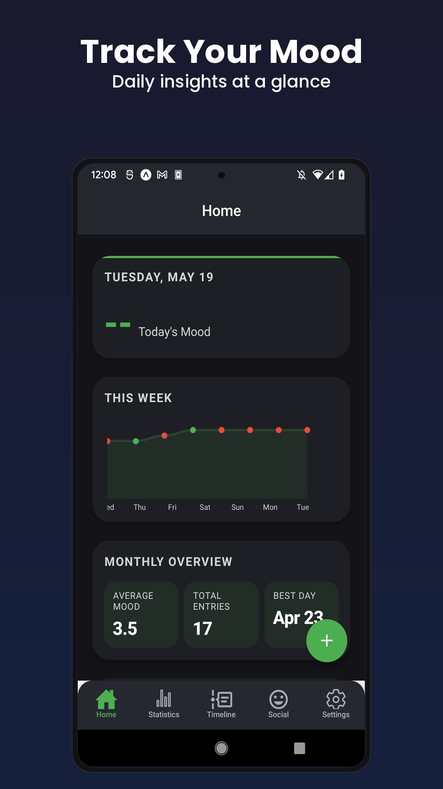
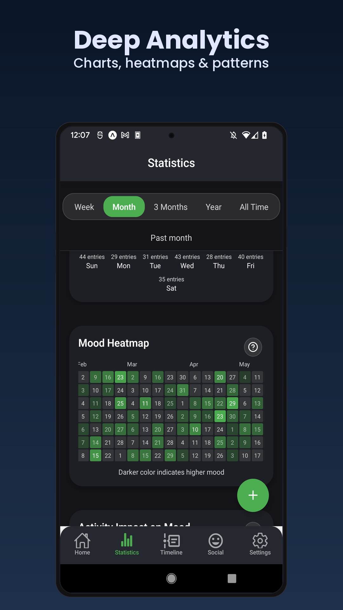
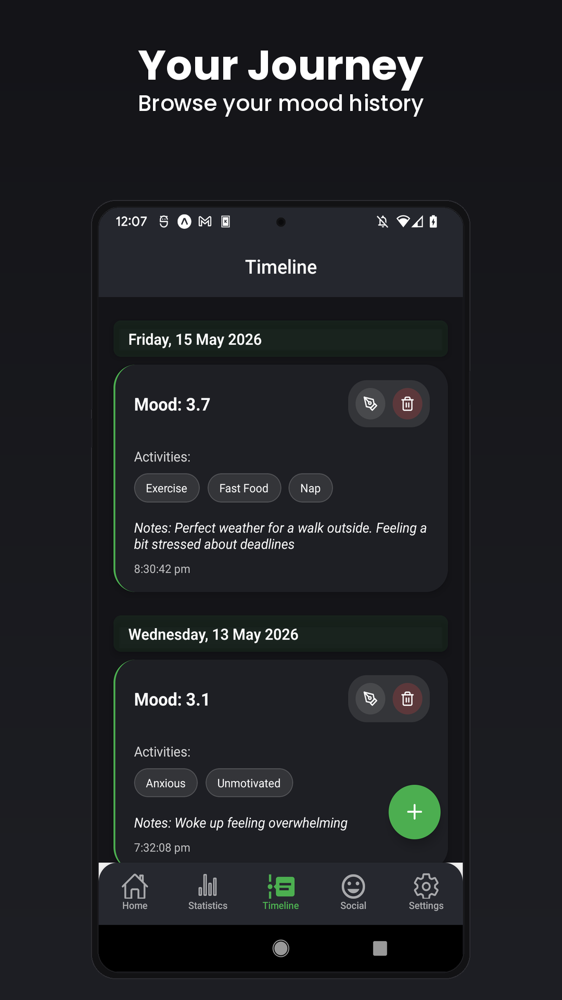
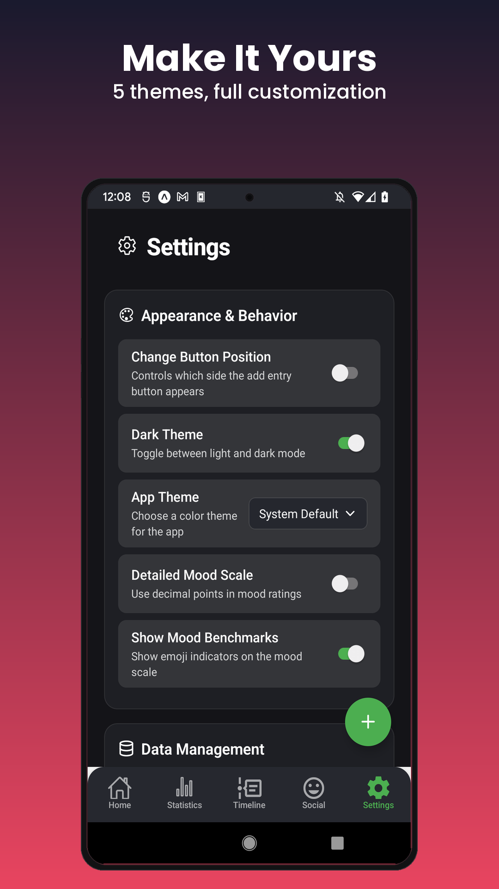

<p align="center">
  
</p>

<p align="center">
  
  
  
  
</p>
<p align="center">
  
  
  
</p>

<p align="center">
  <strong>A privacy-first mood tracker built with React Native and Expo.</strong><br/>
  All data stays on your device. No accounts, no cloud, no tracking.
</p>

---

## Features

<table>
<tr>
<td width="50%" valign="top">

**Mood Tracking**
- 10-point scale with high/low precision modes
- Backdate entries with date/time picker
- Attach activities, notes, and **photos** to each entry
- Daily reminder notifications at a time you choose

**Activities**
- Pre-seeded categories: Emotions, Sleep, Social, Activities, Health
- Fully customizable with icon picker (Feather, MaterialIcons, Ionicons)
- Drag-to-reorder support

</td>
<td width="50%" valign="top">

**Statistics & Insights**
- Mood trend with adaptive moving average
- Day-of-week pattern (your best and toughest days)
- Rigorous with/without activity correlation
- Month-over-month comparison + heatmap
- **Insights tab**: plain-language patterns from your own data

**Customization & Privacy**
- 5 themes: Dark, Light, Cherry Blossom, Midnight Blue, Forest
- JSON import/export for full data portability
- 100% local SQLite database (photos stay on-device too)

</td>
</tr>
</table>

## Screenshots

<p align="center">
  
  
  
  
</p>

## Quick Start

```bash
git clone https://github.com/Antimatter543/mood-tracker.git
cd mood-tracker/frontend && npm install
npx expo start
```

Scan the QR code with [Expo Go](https://expo.dev/go), or press `a` / `i` for emulator.

> **Daily reminders and photo attachments use native modules** (`expo-notifications`, `expo-image-picker`) that are not available in Expo Go on Android. For the full experience run a dev-client build:
> ```bash
> npx expo run:android   # or run:ios
> ```
> **Production builds** use [EAS Build](https://docs.expo.dev/build/introduction/). Update the `projectId` in `app.json` after forking.

## Tech Stack

| Layer | Technology |
|:------|:-----------|
| Framework | [React Native](https://reactnative.dev/) + [Expo](https://expo.dev/) (SDK 52) |
| Routing | [Expo Router](https://docs.expo.dev/router/introduction/) (file-based) |
| Database | [SQLite](https://docs.expo.dev/versions/latest/sdk/sqlite/) (local, on-device) |
| Charts | [react-native-chart-kit](https://github.com/indiespirit/react-native-chart-kit) |
| Calendar | [react-native-calendars](https://github.com/wix/react-native-calendars) |
| Language | TypeScript (strict mode) |

<details>
<summary><strong>Project Structure</strong></summary>

```
frontend/
├── app/                          # Screens (file-based routing)
│   ├── (tabs)/
│   │   ├── index.tsx             # Home dashboard
│   │   ├── timeline.tsx          # Entry history/journal
│   │   ├── stats.tsx             # Analytics & visualizations
│   │   ├── insights.tsx          # Plain-language insights from your data
│   │   └── settings.tsx          # App settings (themes, reminders)
│   └── _layout.tsx               # Root layout (DB provider, themes, reminder re-arm)
├── components/
│   ├── forms/                    # Entry form, mood selector, activity + photo picker
│   │   └── hooks/                # useEntryDraft, useMoodScale
│   └── visualisations/           # Charts, heatmap, calendar
│       └── transforms/           # Pure data transforms (fully tested)
├── context/                      # React contexts (data, settings, timeframe)
├── databases/                    # SQLite facade, migrations, CRUD modules
│   ├── dateHelpers.ts            # Pure local-tz date math
│   ├── mediaHelpers.ts           # On-device photo file storage
│   ├── entry-media.ts            # Photo attachment CRUD
│   └── migrations.ts             # Auto-run schema migrations
├── lib/
│   └── notifications.ts          # Local daily-reminder scheduling (pure + testable)
└── styles/
    └── global.ts                 # Theme definitions
```

</details>

## Testing

| Metric | Status |
|:-------|:-------|
| Test suites | 31 passing |
| Tests | **333 passing** |
| TypeScript | `strict: true`, `tsc --noEmit` clean |
| Lint | `expo lint` zero errors |
| Pre-commit | `npm run check` (typecheck + lint + tests) |

The database layer, chart transforms, form hooks, and date helpers are pure-function modules with dedicated test files.

```bash
npm test              # Run all tests
npm run check         # Full pre-commit gate
```

## Database

| Table | Purpose |
|:------|:--------|
| `entries` | Mood entries (score, notes, timestamp) |
| `activities` | User-defined activities with icons |
| `activity_groups` | Activity categories |
| `entry_activities` | Entry-activity links (many-to-many) |
| `entry_media` | Photo attachments (file path + type, on-device) |
| `user_settings` | Key-value settings store |

Migrations run automatically on app launch via `databases/migrations.ts`.

## Roadmap & Known Issues

**Known Issues**
- Daily reminders require a dev/EAS build on Android (expo-notifications is not supported in Expo Go on Android SDK 52)
- Settings loader shows indefinite spinner if SQLite load fails (needs timeout/fallback)

**Planned**
- CSV/PDF export
- AMOLED dark theme
- Photo attachment cloud-free encrypted backup
- Biometric app lock

## Contributing

1. Fork the repo and create a feature branch
2. Make changes, then run `npm run check` (typecheck + lint + tests)
3. Open a Pull Request

**Tips:** Dev-only features appear when `__DEV__` is true. Add tabs by creating files in `app/(tabs)/`. Themes live in `styles/global.ts`. Database changes go through `databases/migrations.ts`.

## License

[GPL-3.0](LICENSE)

---

<p align="center">
  Built with care. Your data never leaves your device.
</p>
